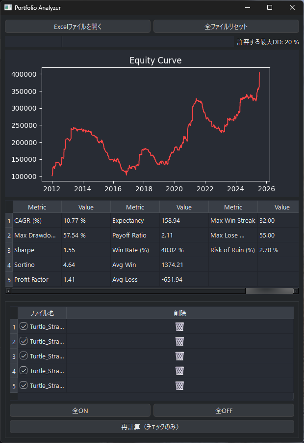

# Portfolio Analyzer

トレーディングビュー（TradingView）のバックテストExcelファイル（.xlsx）を読み込んで、  
**複数銘柄のパフォーマンスを一括評価できるPyQt6ベースのデスクトップアプリ**です。

- ダークテーマ＆黒背景＋赤ラインのエクイティカーブ
- ファイルごとにON/OFF・削除・一括管理可能
- 最大ドローダウン許容値の調整で破産確率(RoR)を即座に再計算

---

## 🚀 特徴

- **複数バックテストファイルを同時分析**（TradingViewエクスポート対応）
- **エクイティカーブ可視化**（黒背景＋赤ラインで高コントラスト）
- **主要トレード指標を自動算出＆3列テーブルで一覧表示**
- **破産許容DD（最大ドローダウン）をスライダーで動的変更 → RoR自動再計算**
- **ファイル管理が直感的**  
  - チェックON/OFFで分析対象を切替
  - ゴミ箱ボタンで個別削除
  - 全ON/全OFF・一括リセットも可能
- **完全なダークテーマUI**（テーブル・ボタン・グラフまで統一）

---

## 📝 使い方

1. **Excelファイルを開く**ボタンからTradingView等でエクスポートした複数の`.xlsx`ファイルを選択
2. エクイティカーブ＆各種指標が自動表示
3. **破産閾値（最大ドローダウン）**をスライダーで調整すると、RoRが即時再計算
4. ファイル管理エリアで個別ON/OFFや削除、全ON/全OFF、一括リセット、再計算ボタンで柔軟に管理・分析
5. 結果をもとにストラテジー評価や比較・改良に活用

---

## 📊 実装されている主要指標

- **CAGR (%)** … 年率複利リターン
- **Max Drawdown (%)** … 最大ドローダウン
- **Sharpe Ratio** … シャープレシオ
- **Sortino Ratio** … Sortinoレシオ
- **Profit Factor** … プロフィットファクター
- **Expectancy** … 1トレードあたり期待値
- **Payoff Ratio** … 平均利益 ÷ 平均損失
- **Win Rate (%)** … 勝率
- **Avg Win / Avg Loss** … 平均利益／損失
- **Max Win Streak / Max Lose Streak** … 最大連勝／連敗
- **Risk of Ruin (%)** … 破産確率（モンテカルロシミュレーション）

---

## 🖥️ スクリーンショット



---

## ⚡ Windowsデスクトップからの起動

- `start_app.bat` をダブルクリックでアプリ起動
- ショートカットをデスクトップに作成しておくと便利

---

## 🛠️ 開発・コントリビュート

- 追加したい指標やUI改善案など **Pull Request・Issue 大歓迎**
- 主要指標の計算ロジックは  
  `pyqt_portfolio_analyzer/models/metrics.py`  
  GUI部分は  
  `pyqt_portfolio_analyzer/views/main_window.py`  
  を参照

---

## 📝 ライセンス

MIT License  
（著作権表記や商用利用、カスタマイズもご自由に）

---

## 📚 参考文献・仕様元

- 『システムトレード 基本と原則』（ブレント・ペンフォールド著）
- 『伝説のトレーダー集団 タートル流投資の魔術』（カーティス・フェイス著）
- TradingView 公式ドキュメント

---

## 🙋 よくある質問

**Q. エラーが出る場合は？**  
A. 必要なPythonパッケージ（openpyxl など）がインストール済みか確認、またはGitHub Issueでご質問ください。

---

## 🛠️ 開発用（環境セットアップ例）

```sh
conda create -n pa-env python=3.12 -y
conda activate pa-env
pip install -r requirements.txt  # 必要パッケージをインストール
python -m pyqt_portfolio_analyzer  # または start_app.bat
