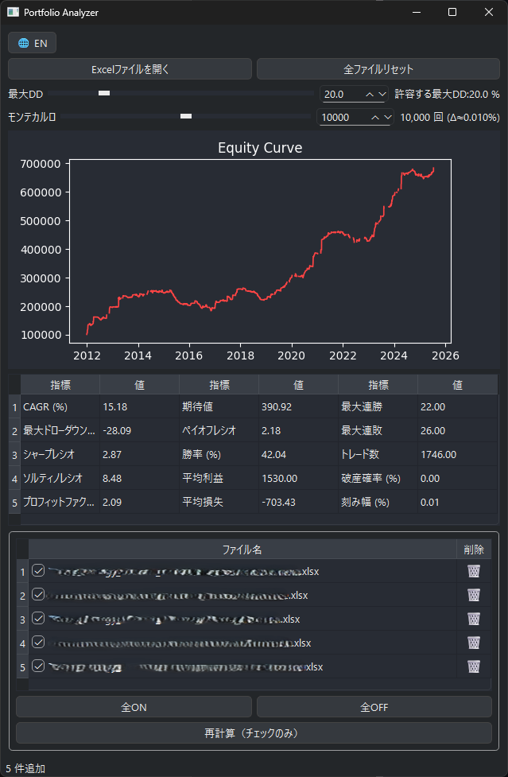

# Portfolio Analyzer

トレーディングビュー（TradingView）のバックテスト Excel ファイル（`.xlsx`）を読み込み、  
**複数銘柄（戦略）のパフォーマンスを一括評価できる PyQt6 デスクトップアプリ** です。

- ダークテーマ & 黒背景＋赤ラインの *Equity Curve*
- 複数ファイルをドラッグ＆ドロップで追加
- ファイルごとに ON/OFF・削除（ゴミ箱）・All ON / All OFF・一括リセット
- 許容最大ドローダウン & Monte Carlo 試行回数をスライダー＋数値入力で即時調整
- 日本語 / 英語 UI ワンクリック切替（タイトル *Equity Curve* は英語固定）

---

## 🚀 主な特徴 (Overview)

| 区分 | 内容 |
|------|------|
| 入力 | 複数 `.xlsx` 追加 / 同時読込 / ドラッグ＆ドロップ |
| ファイル管理 | チェック ON/OFF / 個別削除 / All ON / All OFF / 全リセット / 再計算（選択のみ） |
| 可視化 | ダークテーマ＋赤ラインのエクイティカーブ（高コントラスト） |
| 指標 | CAGR / Max DD / Sharpe / Sortino / Profit Factor / Expectancy / Payoff / Win Rate / Avg Win / Avg Loss / Streaks / Trade Count / Risk of Ruin / RoR Step |
| Monte Carlo | 許容最大 DD (%) と試行回数（1k〜100k＋任意 100〜500k）可変 |
| 多言語 | 日本語 / 英語 即時切替 |
| UX | スライダー＋SpinBox 同期、ドラッグ＆ドロップ、ゴミ箱削除、3ブロック指標レイアウト |
| 実行 | `python -m pyqt_portfolio_analyzer` または `start_app.bat` |

---

## 🧪 Risk of Ruin (Monte Carlo) の概要

- トレード損益系列を **復元抽出 (bootstrap)** でランダム並び生成  
- 途中の最大ピークからのドローダウン率が **許容最大DD (％)** を超えた時点で “破産” 判定  
- 破産率 = 破産が発生した試行数 / 総試行数 × 100  
- 分解能 (RoR Step) = 100 / 試行数  
- 試行回数を増やすと安定するが計算コスト ↑  
- （将来）乱数シード固定オプション予定  

---

## 📊 実装済み指標

| 指標 | 説明 |
|------|------|
| CAGR (%) | 年率複利リターン |
| Max Drawdown (%) | 最大ドローダウン（ピーク比） |
| Sharpe Ratio | 年率化平均 / 年率化標準偏差（Rf=0） |
| Sortino Ratio | 下方偏差を用いた Sharpe 変種 |
| Profit Factor | 総利益 ÷ |総損失| |
| Expectancy | 1トレード期待値 (AvgWin * WinRate − |AvgLoss| * (1−WinRate)) |
| Payoff Ratio | 平均利益 ÷ |平均損失| |
| Win Rate (%) | 勝率 |
| Avg Win / Avg Loss | 勝ち/負け平均損益 |
| Max Win Streak / Max Lose Streak | 最大連勝 / 最大連敗 |
| Trade Count | 総トレード数 |
| Risk of Ruin (%) | Monte Carlo 破産確率 |
| RoR Step (%) | 表示分解能（=100/試行数） |

---

## 🖼 スクリーンショット



---

## 📝 使い方 (Quick Start)

1. 「**Excelファイルを開く**」ボタンか、空のファイルリスト領域に `.xlsx` を **ドラッグ＆ドロップ**  
2. 自動でエクイティカーブ & 指標を計算表示  
3. 許容最大DD (%) をスライダー / 数値入力で変更 → Risk of Ruin 自動再計算  
4. Monte Carlo 試行回数を調整（スライダー or 数値入力）  
5. ファイル一覧で ON/OFF、ゴミ箱削除 / All ON / All OFF / 全リセット  
6. 「再計算（チェックのみ）」で有効ファイルのみ再集計（高速化用）  
7. 🌐 ボタンで JP / EN 切替  

---

## 📦 対応 Excel 形式

| 項目 | 内容 |
|------|------|
| 必須シート | `トレード一覧` |
| 必須列例 | `日時`（約定または確定時刻）、損益列（`損益` / `Profit` 等） |
| 日次集計 | `日時` を日付化 → 日次損益合計 → 累積和で Equity |
| 初期資金 | `metrics.py` 内で定義（例: 100,000）変更可 |

> 列名が異なる場合は `data_loader.py` のマッピングを調整。

---

## ⚙ インストール / 実行

```bash
# 1. 取得
git clone https://github.com/your-account/portfolio_analyzer.git
cd portfolio_analyzer

# 2. 環境作成
conda create -n pa-env python=3.12 -y
conda activate pa-env

# 3. 依存
pip install -r requirements.txt
# （無い場合）
pip install pyqt6 pandas numpy matplotlib openpyxl

# 4. 起動
python -m pyqt_portfolio_analyzer
# または
start_app.bat
